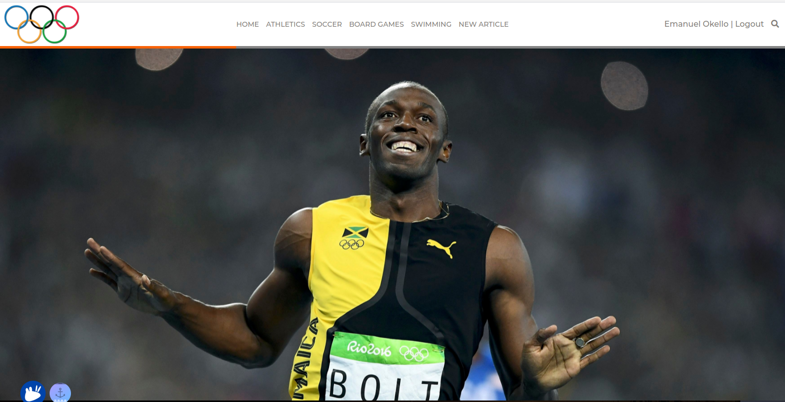

## Olympics Articles
This is the end of Ruby on Rails Capstone Project that;
1. Allows guest users to view categories of articles and comments.
2. Allows guest users to signup for an account.
3. Allows signed up users to login
4. Allows authenticated users to write an article with image url upload, and
5. Allows authenticated users to comment on any article displayed on the home page.

## Screenshot


## Built With

- Ruby v3.0.0
- Ruby on Rails v6.x
- PostgresSQL


## Live Demo

Check the [live version](https://olym-m.herokuapp.com/) of the app!


## Getting Started

To get a local copy up and running follow these simple example steps.

### Prerequisites

- Ruby on Rails v6.x. To learn how to install Ruby on Rails, please follow this [link](https://guides.rubyonrails.org/getting_started.html)
- Postgres

### Setup

- Clone this repository using the link above (click on the 'code' button)
- Create a `.env` file at the root of the project and replace the values accordly, look at `.env.example file` for required keys.
- open a terminal and `cd` to the cloned repository
- run `bundle install` to install the dependencies
- run `rails db:setup`
- run `rails db:migrate` to migrate the rest of the database
- run `rails db:seed`

### Usage

- start a server with `rails s`

- open `http://localhost:3000/` in your browser.

- Sign up with just your name to start writing articles, browse categories and vote other users' posts


### Run tests

```
    rspec -fd
```

### Troubleshooting

If you have problems while creating the database locally, try: 
- `bin/rails db:environment:set RAILS_ENV=development`
- `rails db:setup`

### Deployment

- Deployed in Heroku


## Contirbutor

👤 **Emanuel Okello**

- GitHub: [oxenprogrammer](https://github.com/oxenprogrammer)
- Twitter: [@ox_emmy](https://twitter.com/ox_emmy)
- LinkedIn: [Emanuel Okello](https://www.linkedin.com/in/emanuel-okello/)


## 🤝 Contributing

Contributions, issues and feature requests are welcome!

Feel free to check the [issues page](https://github.com/oxenprogrammer/olympics/issues).

## Show your support

Give a ⭐️ if you like this project!

## Acknowledgments

- Design idea by [Nelson Sakwa on Behance](https://www.behance.net/sakwadesignstudio)
- Microverse Teammate [Alycia](https://github.com/aliciapaz) for helping me with debugging

## 📝 License

This project is [CC](LICENSE) licensed.